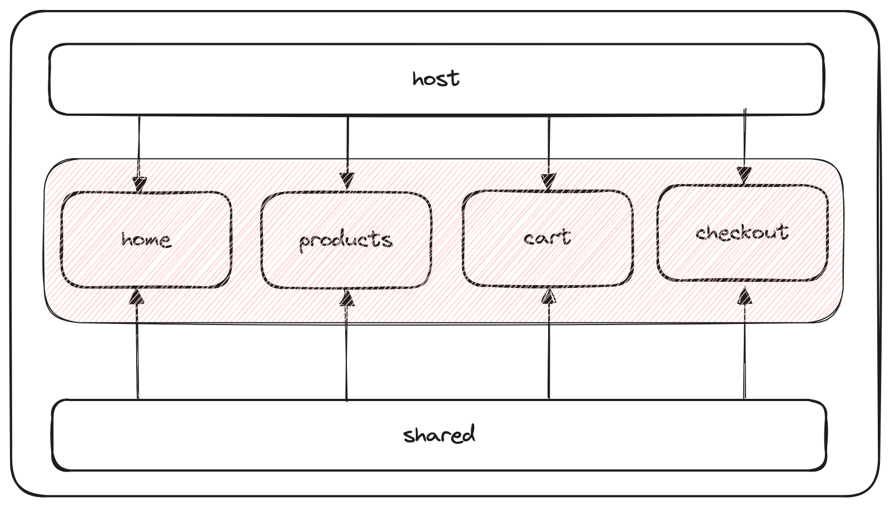

# swifty-shop

    

# Deployment to Production

**Note:** Below is an outline of how the application could be deployed to a production environment if it were production-ready:

## Deployment Overview

### Main Application
- **Hosting**: Deploy the application server to a reliable hosting provider such as Vercel, Netlify, or self-managed infrastructure.
- **Process**: Ensure the main application is configured for scalability, reliability, and security.

### Micro Frontends
- **Build and Deployment**: Generate artifacts for micro frontends and deploy them to cloud storage solutions like Amazon S3, Google Cloud Storage, etc.
- **Content Delivery Network (CDN)**: Utilize a CDN to cache and deliver micro frontend assets efficiently.
- **Runtime Integration**: At runtime, the main application fetches specific micro frontends as needed.

### Shared Components/Libraries
- **Deployment**: For shared components treated as libraries, deploy them to NPM or integrate them within a monorepo setup for consumption across the application.
- **Versioning and Updates**: Ensure proper versioning practices are in place to manage updates and dependencies.

## Additional Considerations
- **Monitoring and Logging**: Implement robust monitoring and logging mechanisms to track application performance, errors, and user interactions.
- **Security Measures**: Employ security best practices such as HTTPS, data encryption, input validation, and access control.
- **Scalability**: Design the architecture with scalability in mind to handle increased traffic and user load effectively.
- **Continuous Integration/Continuous Deployment (CI/CD)**: Automate the deployment process through CI/CD pipelines to ensure rapid and consistent deployments.
- **Backup and Disaster Recovery**: Establish procedures for regular data backups and recovery strategies to mitigate the impact of potential disasters.

This deployment strategy aims to ensure the application is deployed securely, efficiently, and reliably to meet the demands of a production environment.
